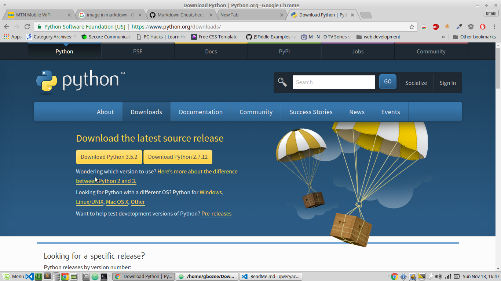
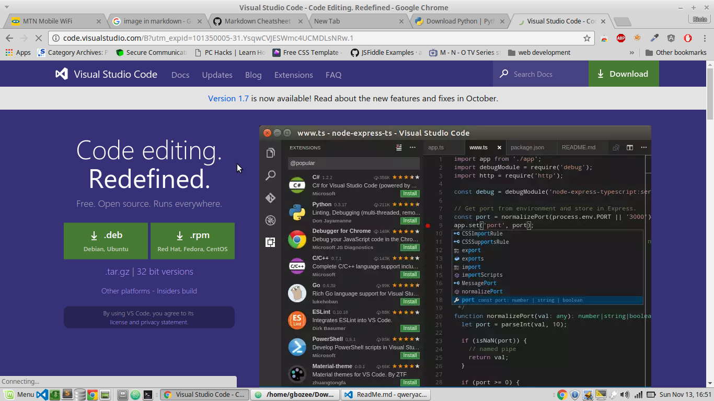
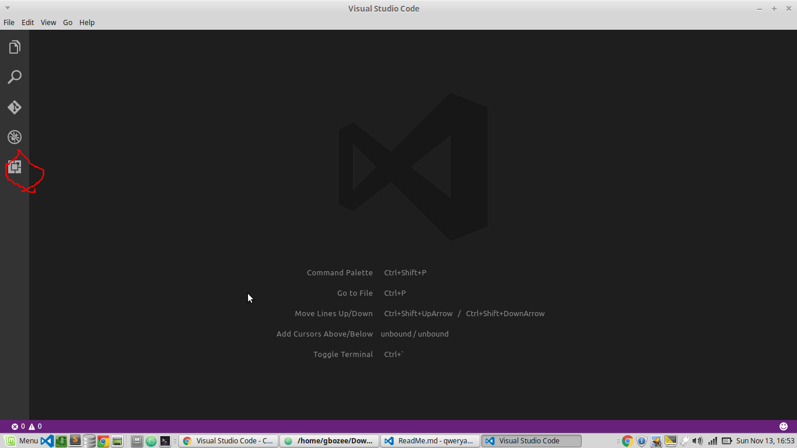
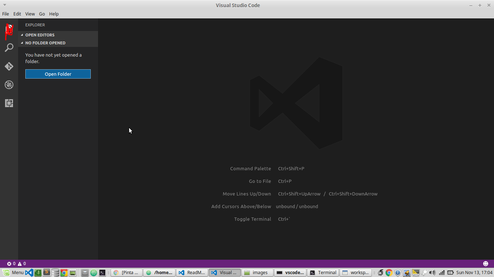
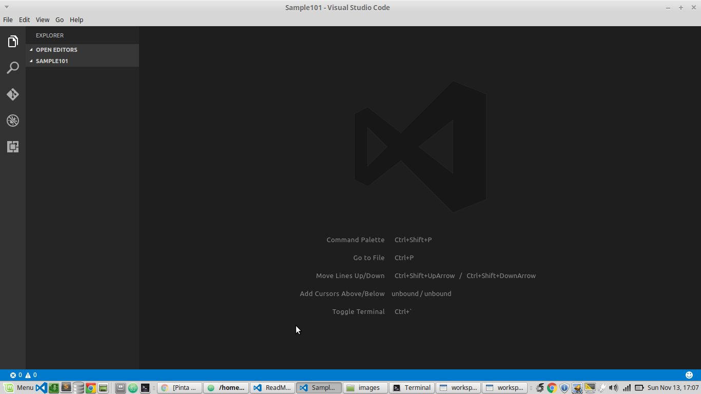

## QweryAcademy Python Introductory Class

### Setting up a python development environment.
The first thing we did was to visit [The official python site](http://python.org/downloads) and selected
version **3.5.2** based on our operating system of choice. 

While we are waiting for the download, We visit [Microsoft VSCode Site](https://code.visualstudio.com/)
and download the text editor. 

### Visual Studio Code Setup
After download the setup for our IDE/Text Editor, we install it and open it up.
We would be greeted with an interface like this

We click on the highlighted section which is the plugins section. This is how we can download
extensions for our text editor. In this case, we would be downloading the `Python Extension by Don Jayamanne`

Once we have downloaded and installed the plugin, We would be prompted to reload our text editior which we should.

Once we have reloaded our text editor, We need to create a folder where we would be carry out all our
development work. Clicking on the highlighted section as shown below
, We are prompted to open a folder. We are free to choose any folder on
our system which we are comfortable with to store all the programs we would be writing. Once we are done selecting
one it would look like this
 
*in my case the folder i chose on my system name is **Sample101***

### The python Installation.

